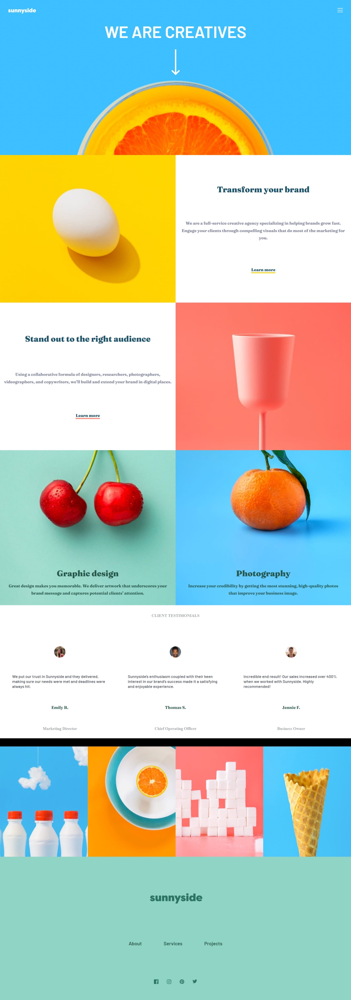

# Frontend Mentor - Sunnyside agency landing page solution

This is a solution to the [Sunnyside agency landing page challenge on Frontend Mentor](https://www.frontendmentor.io/challenges/sunnyside-agency-landing-page-7yVs3B6ef).

## Table of contents

- [Overview](#overview)
  - [The challenge](#the-challenge)
  - [Screenshot](#screenshot)
  - [Links](#links)
- [My process](#my-process)
  - [Built with](#built-with)
  - [What I learned](#what-i-learned)
  - [Continued development](#continued-development)
  - [Useful resources](#useful-resources)
- [Author](#author)
- [Acknowledgments](#acknowledgments)

## Overview

### Screenshot

### Links

- Solution URL: [Solution] (github.com/shalash23/sunnside-agency.git)
- Live Site URL: [Site](https://cerulean-kitten-2eaed9.netlify.app/)

## My process

### Built with

- Semantic HTML5 markup
- CSS custom properties
- Flexbox
- CSS Grid
- Mobile-first workflow
- Vanilla JavaScript

### What I learned

Creating a reponsive menu design was the main challenge I didn't anticipate. The overflowing was hell to deal with.

### Continued development

More into responsive design and media queries

### Useful resources

- [overflow-x](https://stackoverflow.com/questions/14270084/overflow-xhidden-doesnt-prevent-content-from-overflowing-in-mobile-browsers) - This helped me in removing the overflow issues with responsive nav-bar
- [Clamp Calculator](https://royalfig.github.io/fluid-typography-calculator/) - This is an amazing calculator to calculate the clamp values for responsive typography which is always a pain

## Author

- Frontend Mentor - [@Shalash23](https://www.frontendmentor.io/profile/shalash23)
- Twitter - [@shalash23](https://www.twitter.com/yourusername)

## Acknowledgments

I would like to give my thanks to Frontend mentor for providing those challenges. They really helped the most out of any other training platform
